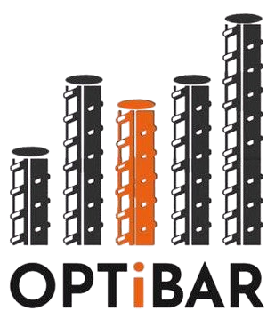

# OPTiBAR

[](./LICENSE)


<p align="center">
  
</p>

<p align="center">
  🚧 **UNDER CONSTRUCTION** 🚧  
  _This project is actively being developed—APIs and features may change._
</p>


[📚 Read the full documentation](https://optibar.readthedocs.io/)  

OPTiBAR is a Python package designed to automate and optimize the generation of concrete structure detailing maps. It streamlines the structural engineering workflow by converting structural analysis software output—such as from ETABS—into precise rebar detailing maps.

## ✅ What It Does

- **Generates rebar detailing maps** from structural analysis software outputs (e.g., ETABS).
- **Uses AutoCAD API** to draw the detailing directly in AutoCAD.
- **Supports both CLI and GUI** interfaces for flexibility in usage.
<!-- - **Integrates with major structural analysis tools** to automate rebar detailing. -->

## ❌ What It Doesn't Do

- Does not perform **structural analysis** or modeling; it only processes outputs from tools like ETABS.
- Does not handle **3D visualization** of rebar placement; only 2D detailing maps.

## 🛠️ Installation

### Prerequisites

- Python 3.12 or higher
- Autodesk Autocad (Full edition, LT doesn't work) for .dwg export (optional)
- MS Excel for .xlsx export (optional)

```bash
pip install optibar
```

Or clone the repository and install locally:

```bash
git clone https://github.com/yourusername/optibar.git
cd optibar
pip install .
```

## How to use

### 🖥️ CLI

### 🖱️GUI

## 👥 Contributors

- [**Sina Hajikazemi**](https://sinahkazemi.github.io)
- [**Amir Salar**](https://github.com/AmirSLRM)

## 🤝 How to Contribute

We welcome contributions! To get started:

1. **Select an issue** labeled **"easy to start"** from the [issues list](https://github.com/OPTiBAR/OPTiBAR/issues).
2. **Fork** the repository and **clone** it to your machine.
3. Create a new branch, make your changes, and **commit** them.
4. **Push** your branch and open a **pull request**.

## 📄 License

This project is licensed under the **GNU General Public License v3.0** – see the [LICENSE](LICENSE) file for details.
